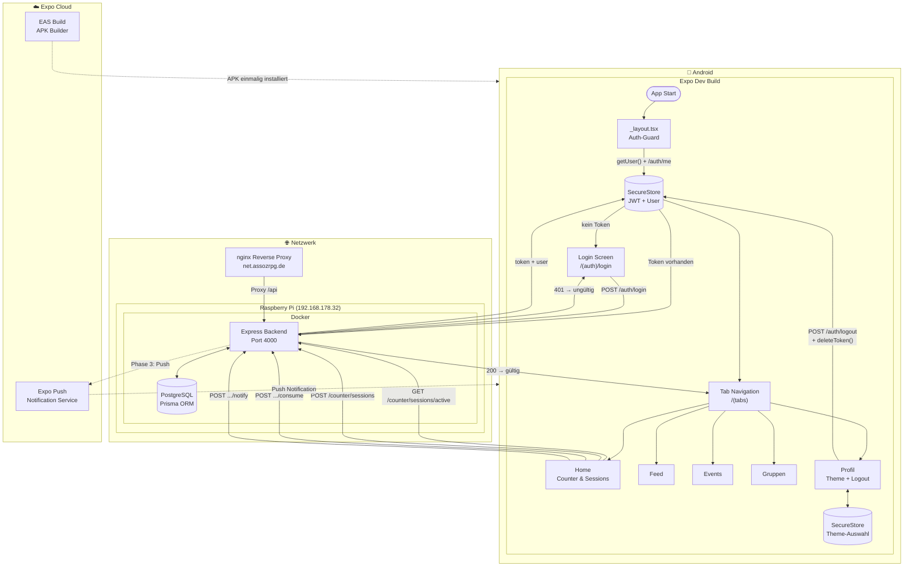

# Mobile App — mein-netzwerk
## Projektplanung (Expo / React Native)

---

## 1. Ziel

Eine native Mobile App für iOS und Android, die dieselbe API wie die Web-App nutzt.
Einstieg mit einfachen Features (Counter, Events, Feed), spätere Erweiterung zum vollständigen Chat-Programm.

---

## 2. Deployment-Strategie (ohne App Store)

```
┌─────────────────────────────────────────────────────────────┐
│                  Wie kommt die App aufs Handy?              │
├───────────────────────┬─────────────────────────────────────┤
│  Phase 1 (Entwicklung)│  Expo Go App                        │
│                       │  → kostenlos im App Store / Play    │
│                       │  → QR-Code scannen → App läuft      │
│                       │  → iOS + Android, kein eigener Store│
├───────────────────────┼─────────────────────────────────────┤
│  Phase 2 (Produktion) │  Android: APK-Sideload              │
│                       │  → "Unbekannte Apps" aktivieren     │
│                       │  → APK per Link/WhatsApp schicken   │
│                       │  → direkt installieren              │
│                       │                                     │
│                       │  iOS: Expo Go bleibt die beste      │
│                       │  kostenlose Option für private Kreise│
└───────────────────────┴─────────────────────────────────────┘
```

> **Fazit:** Während der Entwicklung läuft alles über Expo Go (kostenlos, kein Store).
> Für Android-Nutzer kann später eine eigenständige APK gebaut und direkt verteilt werden.
> iOS ohne Store-Kosten ($99/Jahr) → weiter via Expo Go.

---

## 3. Systemarchitektur



### Älteres ASCII-Diagramm (zur Referenz)

```
┌──────────────────────────────────────────────────────────┐
│                    CLIENT-SCHICHT                        │
│                                                          │
│   ┌─────────────────────┐   ┌─────────────────────┐     │
│   │   Web App           │   │   Mobile App        │     │
│   │   React + Vite      │   │   Expo (React Native│     │
│   │   Port 5173 (dev)   │   │   EAS Dev Build     │     │
│   └──────────┬──────────┘   └──────────┬──────────┘     │
│              │                         │                 │
│              └────────────┬────────────┘                 │
│                           │ REST API                     │
└───────────────────────────┼──────────────────────────────┘
                            │
┌───────────────────────────▼──────────────────────────────┐
│                    BACKEND-SCHICHT                        │
│                                                          │
│   Express.js + Prisma ORM                                │
│   net.assozrpg.de (Raspberry Pi)                         │
│                                                          │
│   /api/auth        /api/users      /api/posts            │
│   /api/groups      /api/events     /api/counter  ✅      │
│   /api/push        (Phase 3)                             │
└───────────────────────────┬──────────────────────────────┘
                            │
┌───────────────────────────▼──────────────────────────────┐
│                    DATEN-SCHICHT                          │
│                                                          │
│   PostgreSQL (Docker auf Raspberry Pi)                   │
│   Prisma Schema: User, Post, Group, Event,               │
│                  JoinSession, ConsumptionEntry ✅         │
│                  PushToken (Phase 3)                     │
└──────────────────────────────────────────────────────────┘
```

---

## 4. Tech-Stack

| Layer | Technologie | Version | Rolle & Funktion |
|-------|------------|---------|-----------------|
| Framework | Expo + React Native | SDK 54 | Basis der App — React-Code wird in native Android/iOS-Komponenten übersetzt |
| Navigation | Expo Router | ~6.0 | Dateibasiertes Routing: jede Datei in `app/` wird automatisch eine Route |
| HTTP | Axios | ^1.14 | Alle API-Calls gegen das Backend — hängt JWT automatisch als Bearer-Token an |
| Auth-Speicher | Expo SecureStore | ~15.0 | Verschlüsselter Keychain auf dem Gerät — speichert JWT + User-Objekt sicher |
| Push (Frontend) | expo-notifications | ~0.29 | Berechtigungen anfragen, Expo Push Token holen, Benachrichtigungen empfangen |
| Push (Backend) | expo-server-sdk | (auf Pi) | Sendet Push-Nachrichten über Expos Cloud-Dienst an registrierte Geräte |
| Push (Transport) | Firebase FCM | (Google) | Googles Infrastruktur für Android-Push — Expo nutzt FCM im Hintergrund. Konfiguriert via `google-services.json` + Firebase-Projekt `assoz-net` |
| Build | EAS Build | (Cloud) | Baut native Android APK auf Expos Servern — 15 Builds/Monat kostenlos. Nötig wenn native Module (z.B. expo-notifications) hinzukommen |
| Sprache | TypeScript | ~5.9 | Typsicherheit, Fehler zur Entwicklungszeit erkennen |
| Styling | React Native StyleSheet | — | Inline-Styles direkt in den Komponenten, analog zu CSS-in-JS |

---

## 5. Ordnerstruktur

```
mein-netzwerk-app/
│
├── app/                            # Expo Router — jede Datei = eine Route
│   ├── _layout.tsx                 # Root Layout: Auth-Check, Theme
│   ├── (auth)/                     # Nicht-eingeloggte Routen
│   │   ├── _layout.tsx
│   │   ├── login.tsx
│   │   └── register.tsx
│   │
│   └── (tabs)/                     # Tab-Navigation (eingeloggt)
│       ├── _layout.tsx             # Tab Bar: Home, Feed, Events, Profil
│       ├── index.tsx               # Home / Joint Counter
│       ├── feed.tsx                # Posts-Feed
│       ├── events.tsx              # Kalender / Events
│       ├── groups.tsx              # Gruppenübersicht
│       └── profile.tsx             # Eigenes Profil
│
├── components/                     # Wiederverwendbare UI-Teile
│   ├── JointCounter.tsx
│   ├── PostItem.tsx
│   ├── EventCard.tsx
│   ├── GroupBadge.tsx
│   └── Avatar.tsx
│
├── lib/                            # Logik / Services
│   ├── api.ts                      # Axios-Wrapper (wie api.js im Web)
│   ├── auth.ts                     # JWT aus SecureStore lesen/schreiben
│   └── notifications.ts           # Push Token registrieren
│
├── hooks/                          # Custom React Hooks
│   ├── useAuth.ts
│   └── useCounter.ts
│
├── constants/
│   └── colors.ts                   # Theme-Farben (passend zur Web-App)
│
├── app.json                        # App-Config: Name, Icon, Bundle-ID
├── eas.json                        # EAS Build-Config
├── tsconfig.json
└── package.json
```

---

## 6. Neue Backend-Endpunkte (minimal)

### 6a. Counter

```
GET  /api/counter/:name          → { name, value, updatedAt, updatedBy }
POST /api/counter/:name/inc      → { name, value }   (+1, auth required)
POST /api/counter/:name/reset    → { name, value: 0 } (admin only)
```

**Prisma-Modell:**
```prisma
model Counter {
  id          Int      @id @default(autoincrement())
  name        String   @unique
  value       Int      @default(0)
  updatedAt   DateTime @updatedAt
  updatedById Int?
  updatedBy   User?    @relation(fields: [updatedById], references: [id])
}
```

### 6b. Push Tokens

```
POST /api/push/register          → { token } speichern
POST /api/push/send              → Nachricht an alle (admin only)
```

**Prisma-Modell:**
```prisma
model PushToken {
  id        Int      @id @default(autoincrement())
  token     String   @unique
  userId    Int
  user      User     @relation(fields: [userId], references: [id])
  createdAt DateTime @default(now())
}
```

---

## 7. Phasenplan

### Phase 1 — Grundgerüst ✅ Abgeschlossen (2026-04-03)
- [x] Expo-Projekt anlegen
- [x] Expo Router einrichten, Tab-Navigation
- [x] `lib/api.ts` — Axios gegen `net.assozrpg.de`
- [x] Login-Screen, Token in SecureStore / localStorage speichern
- [x] Auth-Guard: nicht eingeloggt → Login
- [x] Alle Tab-Screens als Platzhalter

**Ergebnis:** App startet, Login funktioniert, Tabs sind navigierbar ✅

#### Gelernte Erkenntnisse Phase 1
- Das Backend nutzt **httpOnly-Cookies** (für Web) + gibt den **Token im Response-Body** zurück (für Mobile) → Backend-Anpassung nötig: `token` in `res.json()` ergänzt
- **SecureStore** funktioniert nicht im Browser → `Platform.OS === 'web'` Fallback auf `localStorage`
- **Auth-Guard** muss bei jeder Routenänderung neu prüfen (`useEffect` auf `segments`), nicht nur beim App-Start — sonst wird nach Login sofort zurück zum Login geleitet
- `router.replace()` statt `router.push()` damit der Login-Screen nicht im Backstack bleibt
- Web-Testing via `react-native-web` + `react-dom` möglich (`npx expo start` → `w`)
- **Expo Go** auf Android/iOS: `npx expo start --no-web` → QR-Code scannen
- `newArchEnabled: false` für Expo Go Kompatibilität
- Backend läuft auf Pi in **Docker** (`assoz-backend` Container) — Änderungen erfordern `git pull` auf dem Pi + Container-Neustart

---

### Phase 2 — Core Features ✅ Abgeschlossen (2026-04-03)
- [x] Counter-Feature: Sessions erstellen/beenden, Konsum zählen (Bier/Wein/Shot/Cocktail/Joint/Line)
- [x] Statistiken-Tabelle pro Session
- [x] Theme-System: 7 Themes, Persistenz via SecureStore
- [x] Logout-Funktion im Profil-Screen
- [x] EAS Development Build (APK) — läuft auf Android ohne Expo Go
- [x] Auth-Guard mit Token-Validierung gegen Backend
- [ ] Feed-Screen: Posts anzeigen (read-only, `/api/posts`)
- [ ] Gruppen-Liste + Gruppen-Detail-Screen (`/api/groups`)
- [ ] Profil-Screen mit echten Userdaten + Avatar

**Ergebnis:** Counter-Feature vollständig, App läuft als echter Dev Build auf Android ✅

---

### Phase 3 — Push-Benachrichtigungen ✅ Abgeschlossen (2026-04-03)
- [x] `expo-notifications` installieren
- [x] Push-Token beim Login registrieren → Backend speichern (`/counter/push/register`)
- [x] Benachrichtigungen empfangen (Foreground + Background)
- [x] Berechtigungen anfragen (Android)
- [x] Firebase FCM V1 Service Account in Expo Credentials hinterlegt
- [x] `google-services.json` in App eingebunden

**Ergebnis:** Nutzer bekommen Benachrichtigungen auf dem Handy ✅

---

### Phase 4 — Chat (8–12 Std.)
- [ ] WebSocket-Verbindung (vorhandener `/ws` Endpoint)
- [ ] Chat-Screen: Konversationsliste
- [ ] Echtzeit-Nachrichten senden/empfangen
- [ ] Push bei neuer Nachricht (App im Hintergrund)

**Ergebnis:** Vollständiges Chatprogramm

---

## 8. Meilenstein-Übersicht

```
Phase 1  ████████████████████████  Grundgerüst + Auth         ✅
Phase 2  ████████████████████████  Counter + EAS Dev Build    ✅
Phase 3  ████████████████████████  Push-Benachrichtigungen    ✅
Phase 4  ░░░░░░░░░░░░░░░░░░░░░░░░  Feed + Gruppen + Profil    ← nächste
Phase 5  ░░░░░░░░░░░░░░░░░░░░░░░░  Chat (Vollausbau)
          └── je Phase ca. 1–2 Abende
```

---

## 9. Offene Entscheidungen

| Thema | Option A | Option B | Empfehlung |
|-------|----------|----------|------------|
| Sprache | TypeScript | JavaScript | TypeScript (Expo-Standard) |
| Styling | NativeWind | StyleSheet | NativeWind (vertrauter) |
| iOS-Dist. | Expo Go | Apple Dev ($99) | Expo Go (kostenlos) |
| Android-Dist. | APK Sideload | Play Store ($25) | APK Sideload |

---

*Erstellt: 2026-04-02 — Zuletzt aktualisiert: 2026-04-03 — Stand: Phase 1 abgeschlossen*
